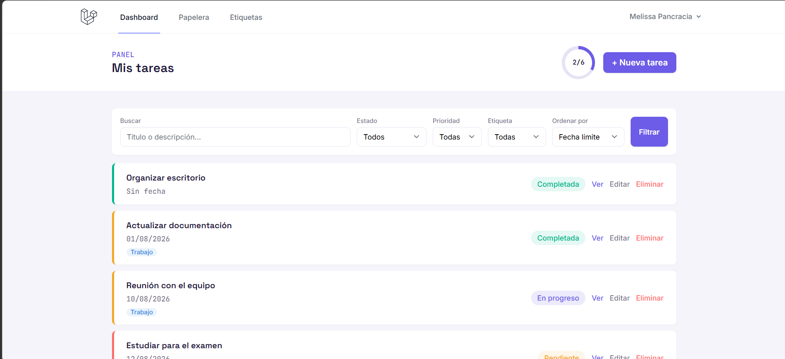
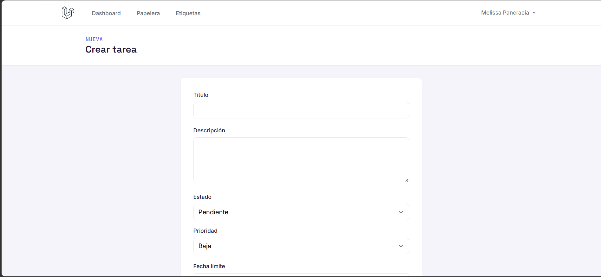
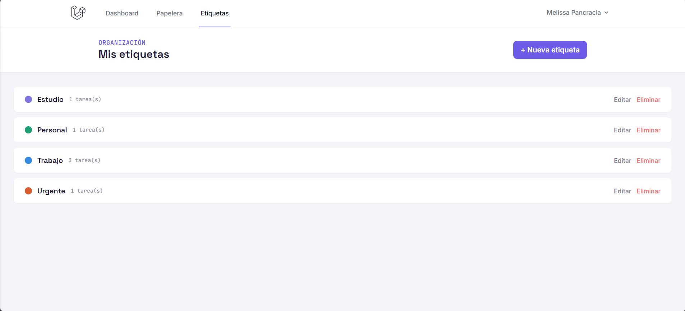
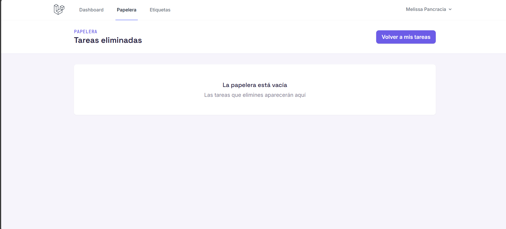
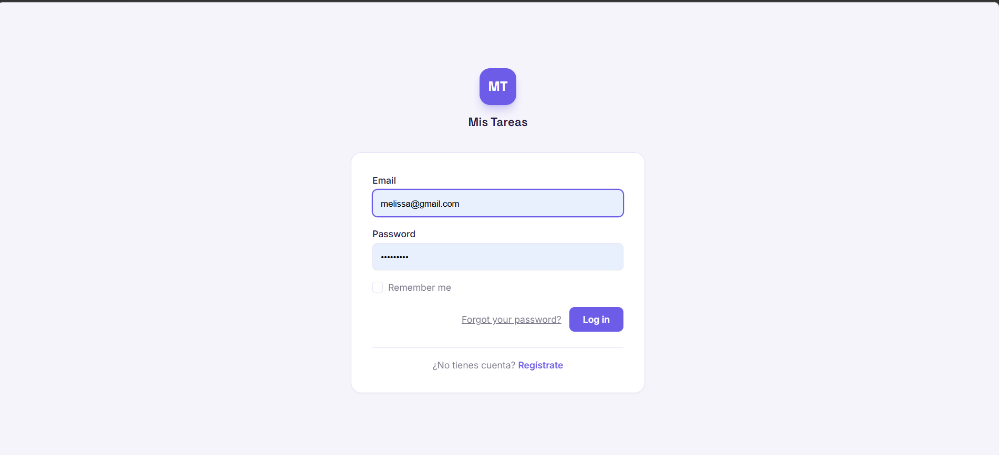

# ✅ Task Manager - Laravel

Aplicación web para la **gestión de tareas personales y académicas**, desarrollada con Laravel.

El sistema permite que cada usuario administre sus propias tareas mediante una interfaz web, incorporando autenticación, verificación de correo electrónico, etiquetas, prioridades, estados, filtros y una papelera para recuperar tareas eliminadas.

## 🖥️ Vista del sistema

### Dashboard



### Gestión de tareas



### Gestión de etiquetas



### Papelera



### Inicio de sesión



## 🚀 Funcionalidades

* Registro e inicio de sesión de usuarios.
* Verificación de correo electrónico.
* Recuperación y restablecimiento de contraseña.
* Gestión del perfil del usuario.
* Creación, visualización, edición y eliminación de tareas.
* Estados de tarea: **Pendiente, En progreso y Completada**.
* Prioridades: **Baja, Media y Alta**.
* Fechas límite con validación para impedir fechas anteriores al día actual.
* Creación y administración de etiquetas personalizadas.
* Asignación de múltiples etiquetas a una tarea.
* Búsqueda de tareas por título o descripción.
* Filtros por estado, prioridad y etiqueta.
* Ordenamiento por fecha límite, prioridad o fecha de creación.
* Paginación de resultados.
* Estadísticas de tareas totales y completadas.
* Papelera mediante **Soft Deletes**.
* Restauración de tareas eliminadas.
* Eliminación definitiva desde la papelera.
* Control de acceso para impedir que un usuario consulte o modifique tareas pertenecientes a otro usuario.

## 🛠️ Tecnologías utilizadas

* **PHP 8.2+**
* **Laravel 12**
* **Laravel Breeze**
* **Blade**
* **Tailwind CSS**
* **Alpine.js**
* **Vite**
* **Eloquent ORM**
* **SQLite**
* HTML
* CSS
* JavaScript

## 🔐 Seguridad

El sistema utiliza el mecanismo de autenticación de Laravel y protege las funcionalidades principales mediante middleware de autenticación y verificación de correo electrónico.

Cada tarea y etiqueta pertenece a un usuario específico. Las operaciones sobre estos recursos verifican su propietario para evitar que otros usuarios puedan consultar o modificar información que no les pertenece.

Las contraseñas son gestionadas mediante el sistema de hashing proporcionado por Laravel.

## 🗂️ Gestión de tareas

Cada tarea puede almacenar:

* Título.
* Descripción.
* Estado.
* Prioridad.
* Fecha límite.
* Una o varias etiquetas.

El sistema incorpora validaciones para garantizar la integridad de la información y controlar las relaciones entre usuarios, tareas y etiquetas.

## 🔎 Búsqueda y filtros

El dashboard permite localizar y organizar tareas mediante:

* Búsqueda por título o descripción.
* Estado.
* Prioridad.
* Etiqueta.
* Fecha límite.
* Orden de prioridad.
* Fecha de creación.

Estas herramientas facilitan la administración de múltiples tareas y permiten al usuario localizar rápidamente la información que necesita.

## 🏷️ Etiquetas

Los usuarios pueden crear y administrar etiquetas personalizadas para clasificar sus tareas.

Una tarea puede tener múltiples etiquetas, permitiendo organizar la información de acuerdo con diferentes categorías o contextos.

## 🗑️ Papelera

Las tareas utilizan **Soft Deletes**, por lo que al eliminarlas inicialmente no desaparecen permanentemente de la base de datos.

Desde la papelera el usuario puede:

* Restaurar una tarea eliminada.
* Eliminar una tarea definitivamente.

## ⚙️ Instalación

### 1. Clonar el repositorio

```bash
git clone https://github.com/garridomelissa556-del/task-manager-laravel.git
cd task-manager-laravel
```

### 2. Instalar las dependencias de PHP

```bash
composer install
```

### 3. Instalar las dependencias del frontend

```bash
npm install
```

### 4. Crear el archivo de entorno

En Linux/macOS:

```bash
cp .env.example .env
```

En Windows puede copiarse manualmente `.env.example` y renombrarlo como `.env`.

### 5. Generar la clave de la aplicación

```bash
php artisan key:generate
```

### 6. Configurar la base de datos

Configure la conexión correspondiente dentro del archivo `.env`.

Después ejecute las migraciones:

```bash
php artisan migrate
```

### 7. Compilar los recursos frontend

```bash
npm run dev
```

### 8. Iniciar el servidor

```bash
php artisan serve
```

La aplicación estará disponible normalmente en:

```text
http://127.0.0.1:8000
```

## 📧 Verificación de correo electrónico

El proyecto incorpora verificación de correo electrónico mediante Laravel.

Para utilizar el envío real de correos es necesario configurar un servicio SMTP mediante las variables `MAIL_*` del archivo `.env`.

Las credenciales privadas y variables sensibles no deben almacenarse directamente en el repositorio.

## 📄 Documentación

El repositorio incluye el archivo:

`INFORME FINAL-PROYECTO.pdf`

Este documento contiene información adicional relacionada con el desarrollo y documentación del proyecto.

## 🎯 Objetivo del proyecto

Desarrollar una aplicación web completa de gestión de tareas aplicando conceptos de desarrollo **backend y frontend**, autenticación, autorización, persistencia de datos, relaciones entre modelos, validación de información y diseño de interfaces utilizando el ecosistema Laravel.

---

Desarrollado con **Laravel, PHP y Tailwind CSS**.
